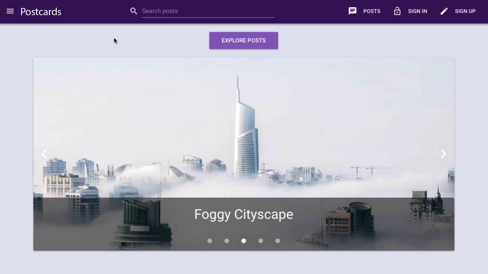
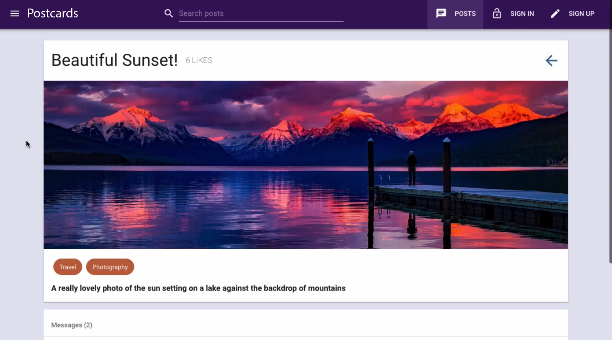
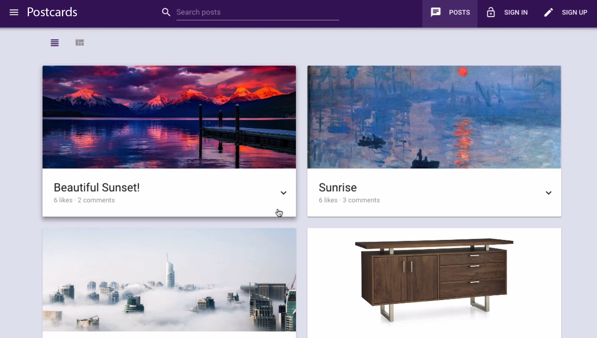
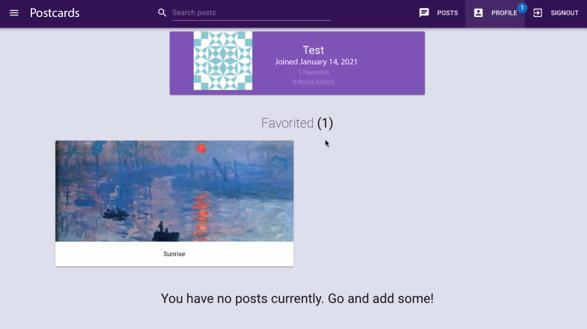

# fullstack-vue-graphql-web-app
A fullstack web application that uses Vue.js as a frontend, and MongoDB with Apollo GraphQL as a backend. The application supports secure user authentication (registration and sign in), posting, post updating and removal, liking and commenting.

